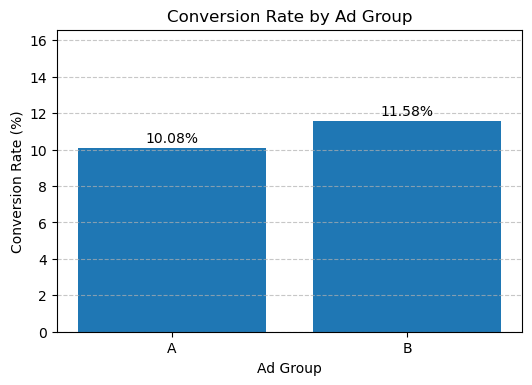

## 📊 Project Preview

*Conversion rate comparaison between Ad A and Ad B*

*Plausible values of the true effect (difference in conversion rates)*

# 📊 A/B Testing Analysis: Advertisement Campaign Performance

## 📌 Project Overview

This project simulates an A/B test to compare the performance of two advertisement campaigns (Ad A and Ad B). The objective is to determine whether one campaign leads to a higher user conversion rate and to provide a data-driven recommendation to stakeholders.

The analysis combines statistical testing, confidence intervals, and power analysis to evaluate both the significance and practical impact of observed differences.

---

## 🎯 Objectives

- Compare conversion rates between two advertisement campaigns  
- Determine whether the observed difference is statistically significant  
- Estimate uncertainty using confidence intervals  
- Assess whether the experiment is sufficiently powered  
- Provide actionable business recommendations  

---

## 🧪 Methodology

The project follows a structured analytical workflow:

1. **Data Simulation & Engineering**
   - Generated realistic A/B test data
   - Introduced missing values, duplicates, and inconsistencies

2. **Exploratory Data Analysis (EDA)**
   - Assessed data quality and distribution
   - Identified issues affecting analysis

3. **Data Cleaning**
   - Removed duplicates
   - Handled missing values
   - Standardized categorical variables

4. **Feature Engineering**
   - Extracted day-of-week and time-based features

5. **Business Insights**
   - Analyzed conversion trends by day and campaign
   - Identified patterns and potential segmentation effects

6. **Hypothesis Testing**
   - Two-proportion z-test
   - Significance level: α = 0.05

7. **Confidence Interval**
   - Estimated range of plausible effects

8. **Power Analysis**
   - Evaluated whether the sample size was sufficient

9. **Visualization**
   - Conversion rates by campaign and by day
   - Confidence interval visualization

---

## 📊 Key Results

- **Ad A conversion rate:** 10.08%  
- **Ad B conversion rate:** 11.58%  
- **Observed difference:** +1.5 percentage points  

- **p-value:** 0.29 → Not statistically significant  
- **95% Confidence Interval:** -3.8 to +6.8 percentage points  
- **Effect size:** 0.048 (very small)  
- **Required sample size:** ~6,777 users per group  

---

## 📈 Interpretation

- The observed difference is **not statistically significant**
- The confidence interval includes zero → effect may be positive or negative
- The experiment is **underpowered**, meaning it cannot reliably detect small effects
- Even if significant, the effect size suggests **minimal practical impact**

---

## 💼 Business Recommendation

Although Ad B shows a slightly higher conversion rate, there is insufficient statistical evidence to conclude that it outperforms Ad A.

👉 **Recommendation:**
- Do not make a decision based on this experiment alone  
- Conduct a larger-scale experiment with sufficient sample size  
- Optionally investigate time-based effects (e.g., day of the week)  

---

## ⚠️ Limitations

- The experiment is underpowered due to small sample size  
- Data is simulated and may not reflect real-world complexity  
- Time-based effects were explored but not formally tested  

---

## ▶️ How to Run

1. Clone the repository  
2. Install dependencies  
3. Open the notebook in `/notebooks`  

## 🗂️ Project Structure

## 👤 Author

Akowe S. Atty  
[GitHub Profile](https://github.com/TontonGit)
